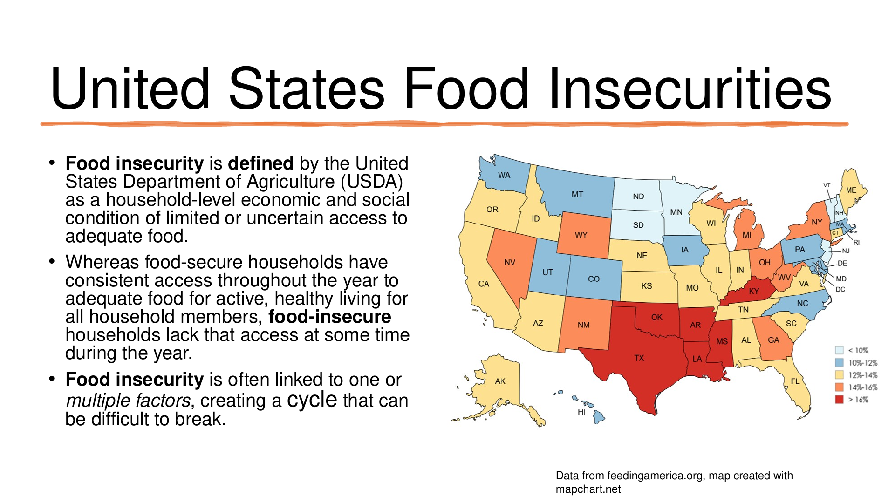
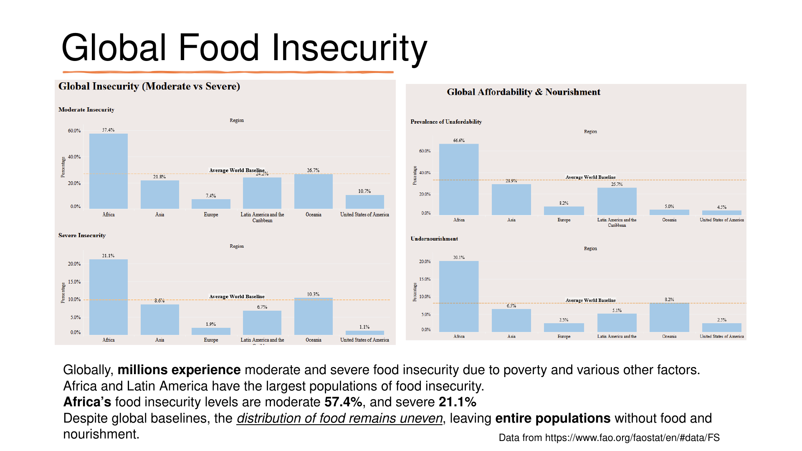
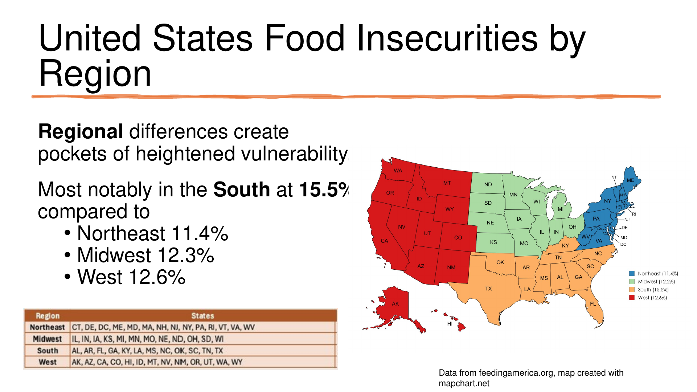
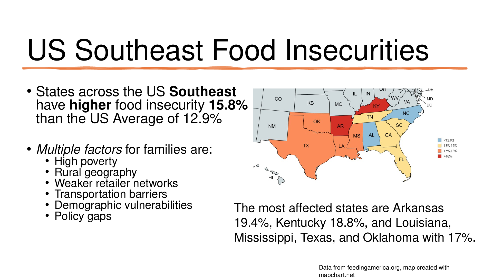
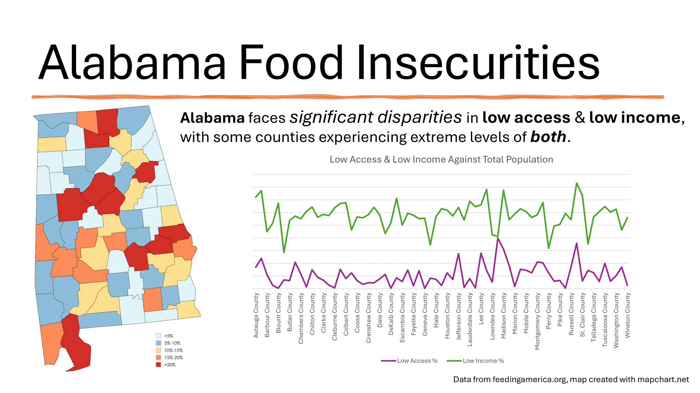
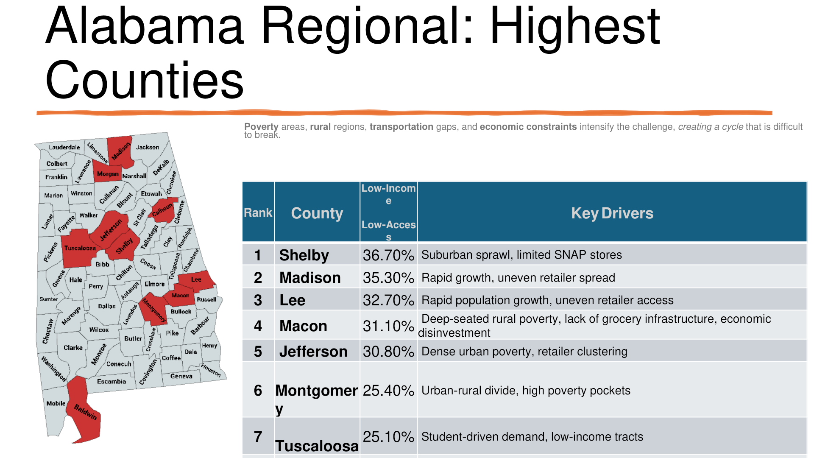

# Data For Dinner Team 2026

This project is a submission of the 2026 Women in Data (WiD) What's Cooking Datathon. Data For Dinner Team explores food insecurity from the globe to the United States, the Southeast, and Alabama (our home state). The project connects regional food insecurity patterns with the challenges families face in obtaining affordable, nourishing food, and proposes practical actions for local communities.

  

**Track:** Eat  
**Final presentation:** September 13, 2026

## Project Links

| Resource | Open |
| --- | --- |
| Data for Dinner Team WiD Datathon 2026 Video Submission | [Download the recording](https://github.com/april-gillespie/Data_For_Dinner_2026/raw/refs/heads/main/video/Data_for_Dinner_2026.mp4) |
| Presentation | [Review the presentation](presentation/DataForDinnerTeam_WiDDatathon2026_Presentation_Final_13Sept2026.pdf) |
| Tableau Public dashboard | [Explore the dashboard](https://public.tableau.com/shared/NX9Y4P32D?%3Adisplay_count=n&%3Aorigin=viz_share_link) |
| Research workbook | [Download the Excel workbook](data/WomenInData_Data_Stats_and_Summary_v3.xlsx) |
| Video guide and captions | [Recording details, original captions, and transcript](video/README.md) |

## The Problem

The United States Department of Agriculture (USDA) defines food insecurity as a household-level economic and social condition of limited or uncertain access to adequate food. Food-secure households have consistent access throughout the year to adequate food for active, healthy living for all household members. Food-insecure households lack that access at some time during the year.

Food insecurity impacts families and diminishes quality of life. Families face an uneven menu of limited access, unaffordability, and undernourishment. We need community-driven solutions that deliver equitable food and nourishment for all.

The stakeholders are local communities and policy makers: families, farmers and home growers, farmers markets, fishers, and town, county, state, and federal government.

## How We Approached It

The team used data sets from FAOSTAT for global food security indicators and Feeding America for U.S. and Alabama context. Processing and analysis included batch downloads, merged datasets, Excel analysis, cleanup of aggregation differences, MapChart visualizations, and a Tableau Public dashboard. For team collaboration, we used GitHub, Google Drive, Google Meet, and Microsoft Teams.

**Scope note:** During the project, we shifted our focus from food access to food insecurity due to local data limitations.

## Key Findings

The figures below follow the final presentation. See the [review notes](docs/review.md#data-and-presentation-notes) for differences between the slides, workbook, and dashboard, including measure definitions and the U.S. comparison average.

### Global Context

- Globally, millions experience moderate and severe food insecurity due to poverty and various other factors.
- The global charts compare percentages across regions; they do not establish which regions have the largest numbers of affected people.
- Slide 12 reports Africa at **57.4%** for the category labeled moderate insecurity and **21.1%** for severe insecurity.
- Despite global baselines, the distribution of food remains uneven, leaving entire populations without food and nourishment.

### United States

- Regional differences create pockets of heightened vulnerability.
- Most notably, food insecurity in the South is **15.5%**, compared with **11.4%** in the Northeast, **12.3%** in the Midwest, and **12.6%** in the West.

### Southeast

- States across the U.S. Southeast have higher food insecurity at **15.8%** than the U.S. average of **12.9%**.
- The most affected states are Arkansas at **19.4%**, Kentucky at **18.8%**, and Louisiana, Mississippi, Texas, and Oklahoma at **17%**.
- Multiple factors affect families:
  - High poverty
  - Rural geography
  - Weaker retailer networks
  - Transportation barriers
  - Demographic vulnerabilities
  - Climate variations that affect crops
  - Policy gaps

### Alabama

Alabama faces significant disparities in low access and low income, with some counties experiencing extreme levels of both.

Poverty, rural regions, transportation gaps, and economic constraints intensify the challenge, creating a cycle that is difficult to break.

## Local Community Solutions

Communities can make rapid progress on food insecurity by focusing on practical, community-driven solutions that leverage existing infrastructure.

These interventions are scalable, cost-effective, and aligned with rural and urban realities:

- Support local food pantries
- Support local shelters
- Stock food pantries with shelf-stable staples, similar to a little library
- Use small community buses as fresh-food pantries
- Support local farmers and fishers

## Future Work

Food allergy impact analysis for food insecurity requires:

- Continued research
- Expanded data discovery
- Deeper insights into:
  - Affordability
  - Access
  - Nutrition

We identified significant food allergens specific to Alabama resources:

- Seafood
  - Shellfish allergy
- Crops
  - Peanuts, ranking third in the nation
  - Sweet potatoes
  - Soybeans
  - Corn
  - Pecans
  - Wheat

Future analysis would consider food allergy constraints and local crop availability.

## Key Takeaways

- Food insecurity is a multi-scale systems challenge that becomes clearer when analyzed through integrated, data-driven geospatial methods.
- Structural instability, economic shocks, and limited food-system resilience create widespread vulnerability.
- Rural isolation and limited food-retail infrastructure intensify insecurity.
- Findings highlight the value of layered geospatial analysis for identifying actionable intervention points and support a practical framework of low-cost, scalable solutions.

## Team

| Team member | Professional Role | Project roles shown |
| --- | --- | --- |
| Sharon Brooks | [Data Governance Analyst](https://www.linkedin.com/in/sharonbrooks1618) | Team Lead; Project Manager |
| April Gillespie | [Technical Marketing Engineer](https://www.linkedin.com/in/april-ee) | Researcher; Data Scientist; GitHub Manager |
| Sandra Kopecky | [IT Specialist](https://www.linkedin.com/in/sandrakopecky) | Data Discovery; Data Analyst; Insights Manager |
| Toni Randell | [IT Data Analyst](https://www.linkedin.com/in/tonitheanalyst) | Dashboarding; Data Analyst |

## Sources and Review

- [FAOSTAT Suite of Food Security Indicators](https://www.fao.org/faostat/en/#data/FS), cited in slides 8 and 12.
- [Feeding America Map the Meal Gap](https://map.feedingamerica.org/), cited in the U.S. and Alabama slides.
- [MapChart](https://www.mapchart.net/usa.html), used for the geographic visuals.
- [Publication review](docs/review.md), covering the video cleanup, file checks, and remaining data differences.

To verify the published media, file hashes, captions, and local links, run `python tools/verify_publication.py` after cloning the repository.
